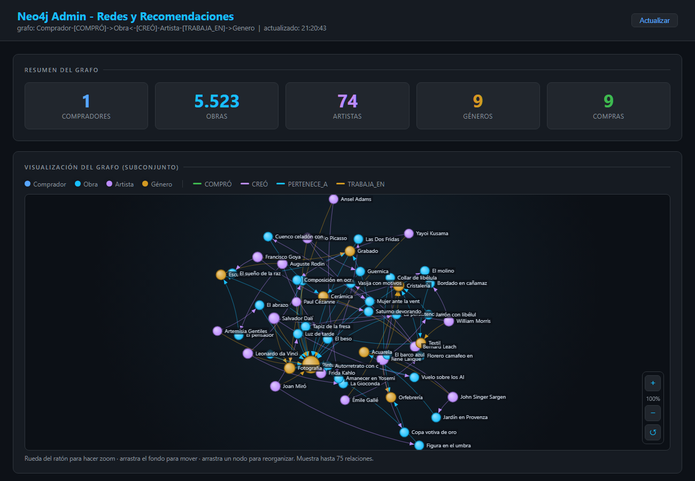

# Sprint 3: Redes de Conocimiento y Recomendaciones (Neo4j)

Plataforma Políglota para el Museo de Arte Contemporáneo
Sistemas de Bases de Datos II

Este documento describe el diseño, la implementación y la operación del cuarto
motor de la plataforma políglota: la base de datos orientada a grafos **Neo4j**,
encargada de las redes de conocimiento y del motor de recomendaciones. Sirve
también como entregable del Sprint 3 (modelo visual del grafo y scripts Cypher
de consultas avanzadas).

## Tabla de contenido

1. Objetivo y contexto del sprint
2. Por qué un grafo para este problema
3. Modelo del grafo (topología de nodos y aristas)
4. Diccionario del grafo (propiedades de cada nodo y relación)
5. Esquema: constraints e índices
6. Arquitectura del microservicio
7. Origen de los datos y migración (seed)
8. Scripts de construcción del grafo (MERGE)
9. Consultas Cypher avanzadas
10. Cómo ejecutar las consultas
11. Integración con el core transaccional (flujo de compra)
12. API REST del servicio
13. Panel de administración y visualización
14. Lugar de Neo4j en el Teorema CAP
15. Instalación y puesta en marcha
16. Reto de Innovación (+5%): Lenguaje Natural a Cypher
17. Recomendaciones en la interfaz del museo
18. Página "Mis compras" del usuario
19. Guion de la Live Demo

## 1. Objetivo y contexto del sprint

El catálogo del museo (MongoDB) y la auditoría transaccional (Cassandra) ya
existen. El reto de este sprint es entender las **preferencias de los
visitantes** para ofrecer recomendaciones precisas basadas en los géneros y los
artistas que cada comprador ha adquirido.

Este tipo de pregunta ("¿qué otras obras del mismo género que ya compré están
disponibles?") implica recorrer relaciones entre entidades. En un modelo
relacional supondría varios JOIN encadenados y costosos. En un grafo, ese
recorrido es la operación nativa y barata: se navega de un nodo a otro siguiendo
las aristas.

## 2. Por qué un grafo para este problema

| Criterio | Justificación |
|---|---|
| Variedad | Los datos son una red de entidades heterogéneas (compradores, obras, artistas, géneros) unidas por relaciones con significado. |
| Velocidad | Las recomendaciones requieren recorridos de varios saltos. Neo4j resuelve esto con index-free adjacency en tiempo casi constante por salto, sin JOIN. |
| Volumen | El grafo crece con las compras, pero las consultas se mantienen locales (parten de un comprador y exploran su vecindad), no escanean toda la base. |
| Naturaleza del problema | "Personas que compraron lo mismo que tú", "más obras del artista que te gusta" y "mismo género que compraste" son patrones de grafo clásicos. |

La regla del proyecto es que la necesidad del negocio dicta el motor, y no al
revés. La necesidad aquí es recomendar siguiendo relaciones, por lo tanto el
motor correcto es una base de datos de grafos.

## 3. Modelo del grafo (topología de nodos y aristas)

La topología pedida por el proyecto es:

```
(Comprador) -[:COMPRÓ]-> (Obra) <-[:CREÓ]- (Artista) -[:TRABAJA_EN]-> (Genero)
```

A esa topología se le añade una arista directa de la obra hacia su género, que
hace la recomendación por género más precisa y eficiente:

```
(Obra) -[:PERTENECE_A]-> (Genero)
```

Diagrama completo del modelo:

```
                          ┌──────────────┐
                          │   Comprador  │
                          │  usuario_id  │
                          │  nombre      │
                          │  email       │
                          └──────┬───────┘
                                 │
                                 │ :COMPRÓ
                                 │ { venta_id, fecha, precio }
                                 ▼
   ┌──────────────┐  :CREÓ   ┌──────────────┐  :PERTENECE_A  ┌──────────────┐
   │   Artista    │ ───────► │     Obra     │ ─────────────► │    Genero    │
   │  artista_id  │          │  obra_id     │                │  nombre      │
   │  nombre      │          │  nombre      │                └──────▲───────┘
   │  nacionalidad│          │  genero      │                       │
   └──────┬───────┘          │  precio      │                       │
          │                  │  estado      │                       │
          │                  └──────────────┘                       │
          │                                                         │
          │                       :TRABAJA_EN                       │
          └─────────────────────────────────────────────────────────┘
```

Lectura del diagrama:

- Un **Comprador** COMPRÓ una o varias **Obras**.
- Cada **Obra** fue CREÓ (creada) por un **Artista**.
- Cada **Obra** PERTENECE_A un **Genero**.
- Cada **Artista** TRABAJA_EN uno o varios **Géneros**.

Esta combinación permite recomendar tanto por género (camino corto Obra a
Genero) como por artista (camino Obra a Artista) y de forma colaborativa
(Comprador a Obra a Comprador).

### Modelo visual interactivo

El panel de administración (`http://localhost:3003/admin`) ofrece una
visualización force-directed del grafo real: nodos coloreados por tipo, aristas
coloreadas por relación, con zoom de rueda, paneo, arrastre de nodos y resaltado
de conexiones al pasar el cursor.



En la visualización: los nodos azules son compradores, los cyan obras, los
morados artistas y los amarillos géneros; el tamaño de cada nodo crece con su
número de conexiones, y cada color de arista corresponde a un tipo de relación
(verde COMPRÓ, morado CREÓ, cyan PERTENECE_A, amarillo TRABAJA_EN).

## 4. Diccionario del grafo

### Nodos

| Etiqueta | Propiedad clave | Otras propiedades | Origen |
|---|---|---|---|
| Comprador | usuario_id (entero, único) | nombre, email | MySQL, tabla Usuario |
| Obra | obra_id (texto, único) | nombre, genero, precio, estado | MongoDB, colección obras |
| Artista | artista_id (texto, único) | nombre, nacionalidad | MongoDB, colección artistas |
| Genero | nombre (texto, único) | (solo el nombre) | Derivado del género de cada obra |

La propiedad `obra_id` guarda el identificador canónico de MongoDB (el `_id`),
porque es la clave que la tabla `Venta` de MySQL utiliza para referenciar la
obra. Así se garantiza que la arista COMPRÓ enlace con el mismo nodo Obra que se
creó desde el catálogo.

### Relaciones (aristas)

| Tipo | Dirección | Propiedades | Significado |
|---|---|---|---|
| COMPRÓ | Comprador a Obra | venta_id, fecha, precio | El comprador adquirió la obra en una venta concretada. |
| CREÓ | Artista a Obra | (ninguna) | El artista es autor de la obra. |
| PERTENECE_A | Obra a Genero | (ninguna) | La obra pertenece a ese género. |
| TRABAJA_EN | Artista a Genero | (ninguna) | El artista trabaja en ese género. |

## 5. Esquema: constraints e índices

Cada propiedad clave tiene un constraint de unicidad, que en Neo4j crea de forma
implícita un índice. Esto vuelve idempotentes los MERGE del seed (no se duplican
nodos) y acelera tanto la carga como las consultas de recomendación. Archivo:
`scripts/schema.cypher`.

```cypher
CREATE CONSTRAINT comprador_id IF NOT EXISTS
FOR (c:Comprador) REQUIRE c.usuario_id IS UNIQUE;

CREATE CONSTRAINT obra_id IF NOT EXISTS
FOR (o:Obra) REQUIRE o.obra_id IS UNIQUE;

CREATE CONSTRAINT artista_id IF NOT EXISTS
FOR (a:Artista) REQUIRE a.artista_id IS UNIQUE;

CREATE CONSTRAINT genero_nombre IF NOT EXISTS
FOR (g:Genero) REQUIRE g.nombre IS UNIQUE;

CREATE INDEX obra_estado IF NOT EXISTS FOR (o:Obra) ON (o.estado);
CREATE INDEX obra_genero IF NOT EXISTS FOR (o:Obra) ON (o.genero);
```

## 6. Arquitectura del microservicio

El servicio sigue el mismo patrón que `mongodb-service` y `cassandra-service`:
un microservicio Node.js con Express, aislado, que se comunica con el core por
HTTP. Vive en `Backend/neo4j-service/` y escucha en el puerto **3003**.

```
Backend/neo4j-service/
├── config/
│   └── neo4j.js                  Driver Bolt y helper run() de consultas
├── controllers/
│   └── recomendacion.controller.js
├── middleware/
│   ├── auth.js                   Token JWT e internal key entre servicios
│   └── errorHandler.js           Traduce caídas de Neo4j a HTTP 503
├── models/
│   └── grafo.js                  Upserts y consultas Cypher (corazón del servicio)
├── routes/
│   ├── recomendaciones.routes.js API REST de recomendaciones
│   └── admin.routes.js           Panel de visualización del grafo
├── services/
│   └── nlToCypher.js             Reto +5%: traductor de lenguaje natural a Cypher
├── scripts/
│   ├── schema.cypher             Constraints e índices
│   ├── seed.js                   Migración desde MySQL y MongoDB
│   └── nl2cypher.js              CLI del traductor de lenguaje natural
├── server.js                     Arranque, CORS, init de constraints con reintentos
├── package.json
└── .env                          Conexión a Neo4j y fuentes de datos
```

Diagrama de la red de microservicios completa:

```
                         ┌───────────────────────────┐
                         │   Frontend (navegador)     │
                         └────────────┬──────────────┘
                                      │ HTTP
                                      ▼
                         ┌───────────────────────────┐
                         │  Core / Backend  (3000)    │
                         │  Express, MySQL, proxies   │
                         └──┬─────────┬─────────┬─────┘
            HTTP proxy      │         │         │     HTTP proxy
        ┌───────────────────┘         │         └──────────────────┐
        ▼                             ▼                            ▼
┌───────────────┐          ┌───────────────────┐        ┌──────────────────┐
│ mongodb-service│         │ cassandra-service │        │   neo4j-service  │
│   (3001)       │         │     (3002)        │        │      (3003)      │
│  Catálogo      │         │  Auditoría        │        │ Recomendaciones  │
│  MongoDB       │         │  Cassandra        │        │   Neo4j          │
└───────────────┘          └───────────────────┘        └──────────────────┘
        │                            │                            │
        ▼                            ▼                            ▼
   MongoDB 27017               Cassandra 9042              Neo4j Bolt 7687
                                                           Browser 7474

   (El core relacional usa MySQL 3306 a través de XAMPP)
```

## 7. Origen de los datos y migración (seed)

El grafo no tiene datos propios: se construye a partir de las otras bases del
museo. El script `scripts/seed.js` es idempotente (usa MERGE) y se puede
reejecutar sin duplicar nada.

Pasos del seed:

1. Aplica los constraints e índices de `schema.cypher`.
2. Descarga todas las obras del catálogo MongoDB (paginando el endpoint del
   `mongodb-service`). Por cada obra crea el nodo Obra, su Genero y su Artista,
   con las aristas CREÓ, PERTENECE_A y TRABAJA_EN.
3. Lee de MySQL las ventas con estado `vendida`, junto con los datos del
   comprador. Por cada venta crea el nodo Comprador y la arista COMPRÓ hacia la
   obra correspondiente.

Diagrama de la migración:

```
   MySQL (Museo)                  MongoDB (museo_catalogo)
   ┌──────────────┐               ┌──────────────────────┐
   │ Usuario      │               │ obras, artistas,     │
   │ Venta        │               │ generos              │
   └──────┬───────┘               └──────────┬───────────┘
          │ ventas vendidas                  │ catálogo (HTTP 3001)
          │ + comprador                      │
          └──────────────┬───────────────────┘
                         ▼
                  scripts/seed.js
                         │ MERGE (idempotente)
                         ▼
                  ┌──────────────┐
                  │    Neo4j     │
                  │   (grafo)    │
                  └──────────────┘
```

Detalle importante sobre el identificador de la obra: el catálogo expone
`obra_id` como `obra_id_original` o, en su defecto, el `_id` de MongoDB. La tabla
`Venta` puede haber guardado cualquiera de los dos. Por eso el seed construye un
índice que mapea ambas claves al `_id` canónico, de modo que cada compra enlace
siempre con el nodo Obra correcto.

## 8. Scripts de construcción del grafo (MERGE)

Todas las escrituras usan `MERGE` (idempotente). Estos son los upserts reales del
modelo (`models/grafo.js`).

Crear o actualizar una Obra y enlazarla a su Género:

```cypher
MERGE (o:Obra {obra_id: $obra_id})
  SET o.nombre = $nombre, o.genero = $genero,
      o.precio = $precio, o.estado = $estado
WITH o, $genero AS gnombre
WHERE gnombre IS NOT NULL AND gnombre <> ''
MERGE (g:Genero {nombre: gnombre})
MERGE (o)-[:PERTENECE_A]->(g);
```

Crear o actualizar un Artista, enlazarlo a la Obra (CREÓ) y al Género (TRABAJA_EN):

```cypher
MERGE (a:Artista {artista_id: $artista_id})
  SET a.nombre = $nombre, a.nacionalidad = $nacionalidad
WITH a
OPTIONAL MATCH (o:Obra {obra_id: $obra_id})
FOREACH (_ IN CASE WHEN o IS NULL THEN [] ELSE [1] END |
  MERGE (a)-[:CREÓ]->(o))
WITH a, $genero AS gnombre
WHERE gnombre IS NOT NULL AND gnombre <> ''
MERGE (g:Genero {nombre: gnombre})
MERGE (a)-[:TRABAJA_EN]->(g);
```

Registrar una compra (núcleo de la integración con el flujo de venta del core):

```cypher
MERGE (c:Comprador {usuario_id: $usuario_id})
  ON CREATE SET c.nombre = $comprador_nombre, c.email = $comprador_email
MERGE (o:Obra {obra_id: $obra_id})
  ON CREATE SET o.nombre = $obra_nombre, o.genero = $genero
SET o.estado = 'Vendida'
FOREACH (_ IN CASE WHEN $genero <> '' THEN [1] ELSE [] END |
  MERGE (g:Genero {nombre: $genero})
  MERGE (o)-[:PERTENECE_A]->(g))
MERGE (c)-[r:COMPRÓ]->(o)
  ON CREATE SET r.venta_id = $venta_id, r.fecha = $fecha, r.precio = $precio
RETURN c.usuario_id AS comprador, o.obra_id AS obra;
```

## 9. Consultas Cypher avanzadas

Estas consultas están implementadas en `models/grafo.js` y son el entregable
principal del sprint. Usan parámetros `$` (Neo4j los recibe de forma segura, sin
concatenar texto).

### 9.1 Recomendar obras del mismo género que el usuario compró

Es la consulta central del enunciado: "sugerir obras del mismo género que el
usuario compró". Mide la afinidad del usuario con cada género (cuántas compras
suyas caen en él) y ordena las recomendaciones por esa afinidad. Excluye las
obras ya compradas y solo sugiere obras disponibles.

```cypher
MATCH (c:Comprador {usuario_id: $usuario_id})-[:COMPRÓ]->(:Obra)-[:PERTENECE_A]->(g:Genero)
WITH c, g, count(*) AS afinidad
MATCH (g)<-[:PERTENECE_A]-(rec:Obra)
WHERE rec.estado = 'Disponible' AND NOT (c)-[:COMPRÓ]->(rec)
OPTIONAL MATCH (autor:Artista)-[:CREÓ]->(rec)
RETURN rec.obra_id   AS obra_id,
       rec.nombre    AS nombre,
       g.nombre      AS genero,
       rec.precio    AS precio,
       autor.nombre  AS artista,
       afinidad      AS afinidad_genero
ORDER BY afinidad_genero DESC, rec.precio ASC
LIMIT $limite;
```

Explicación paso a paso:

1. Se parte del comprador y se recorren sus compras hasta el género de cada obra.
2. `count(*)` mide cuántas compras del usuario pertenecen a cada género (afinidad).
3. Desde ese género se buscan otras obras (`rec`) que pertenezcan a él.
4. El filtro `NOT (c)-[:COMPRÓ]->(rec)` evita recomendar lo que ya tiene, y
   `rec.estado = 'Disponible'` evita recomendar obras vendidas o reservadas.
5. Se resuelve el autor de cada obra recomendada y se ordena por afinidad y precio.

### 9.2 Recomendar obras del mismo artista que el usuario compró

"Más obras disponibles de los artistas que ya te gustaron."

```cypher
MATCH (c:Comprador {usuario_id: $usuario_id})-[:COMPRÓ]->(:Obra)<-[:CREÓ]-(a:Artista)
WITH c, a, count(*) AS compras_artista
MATCH (a)-[:CREÓ]->(rec:Obra)
WHERE rec.estado = 'Disponible' AND NOT (c)-[:COMPRÓ]->(rec)
RETURN rec.obra_id AS obra_id, rec.nombre AS nombre, rec.genero AS genero,
       rec.precio AS precio, a.nombre AS artista, compras_artista AS afinidad_artista
ORDER BY afinidad_artista DESC, rec.precio ASC
LIMIT $limite;
```

### 9.3 Recomendación colaborativa (a dos saltos)

"Coleccionistas que adquirieron lo mismo que tú también compraron." Recorre dos
saltos de COMPRÓ para encontrar compradores parecidos y luego sus otras compras.

```cypher
MATCH (c:Comprador {usuario_id: $usuario_id})-[:COMPRÓ]->(:Obra)<-[:COMPRÓ]-(otro:Comprador)
WHERE otro <> c
MATCH (otro)-[:COMPRÓ]->(rec:Obra)
WHERE rec.estado = 'Disponible' AND NOT (c)-[:COMPRÓ]->(rec)
RETURN rec.obra_id AS obra_id, rec.nombre AS nombre, rec.genero AS genero,
       rec.precio AS precio, count(DISTINCT otro) AS coincidencias
ORDER BY coincidencias DESC, rec.precio ASC
LIMIT $limite;
```

### 9.4 Recomendación variada por tema coherente

El servicio usa por defecto una estrategia "variada": elige un tema coherente
(un género del usuario, un artista del usuario o colaborativo) y devuelve obras
de ese mismo tema, en orden aleatorio, para que cada visita muestre algo distinto
pero coherente. Las dos consultas base son:

Obras disponibles de un género concreto, barajadas:

```cypher
MATCH (c:Comprador {usuario_id: $usuario_id})
MATCH (:Genero {nombre: $genero})<-[:PERTENECE_A]-(rec:Obra)
WHERE rec.estado = 'Disponible' AND NOT (c)-[:COMPRÓ]->(rec)
OPTIONAL MATCH (autor:Artista)-[:CREÓ]->(rec)
RETURN rec.obra_id AS obra_id, rec.nombre AS nombre, $genero AS genero,
       rec.precio AS precio, autor.nombre AS artista
ORDER BY rand()
LIMIT $limite;
```

Obras disponibles de un artista concreto, barajadas:

```cypher
MATCH (c:Comprador {usuario_id: $usuario_id})
MATCH (a:Artista {nombre: $artista})-[:CREÓ]->(rec:Obra)
WHERE rec.estado = 'Disponible' AND NOT (c)-[:COMPRÓ]->(rec)
RETURN rec.obra_id AS obra_id, rec.nombre AS nombre, rec.genero AS genero,
       rec.precio AS precio, a.nombre AS artista
ORDER BY rand()
LIMIT $limite;
```

### 9.5 Perfil de gustos del comprador

Resume los géneros y artistas que el usuario ha comprado. Se usa para mostrar un
mensaje personalizado en la interfaz.

```cypher
MATCH (c:Comprador {usuario_id: $usuario_id})-[:COMPRÓ]->(o:Obra)
OPTIONAL MATCH (o)-[:PERTENECE_A]->(g:Genero)
OPTIONAL MATCH (a:Artista)-[:CREÓ]->(o)
RETURN [x IN collect(DISTINCT g.nombre) WHERE x IS NOT NULL] AS generos,
       [x IN collect(DISTINCT a.nombre) WHERE x IS NOT NULL] AS artistas,
       count(DISTINCT o) AS compras;
```

### 9.6 Consultas de exploración del grafo

Recorrido del patrón completo del modelo (Comprador → Obra ← Artista → Género):

```cypher
MATCH (c:Comprador)-[:COMPRÓ]->(o:Obra)<-[:CREÓ]-(a:Artista)-[:TRABAJA_EN]->(g:Genero)
RETURN c.nombre AS comprador, o.nombre AS obra,
       a.nombre AS artista, g.nombre AS genero
LIMIT 25;
```

Distribución de obras por género:

```cypher
MATCH (g:Genero)<-[:PERTENECE_A]-(o:Obra)
RETURN g.nombre AS genero, count(o) AS total
ORDER BY total DESC;
```

Conteos globales del grafo (tablero de control):

```cypher
RETURN
  count { (:Comprador) }          AS compradores,
  count { (:Obra) }               AS obras,
  count { (:Artista) }            AS artistas,
  count { (:Genero) }             AS generos,
  count { ()-[:COMPRÓ]->() }      AS compras,
  count { ()-[:CREÓ]->() }        AS creaciones,
  count { ()-[:PERTENECE_A]->() } AS pertenencias,
  count { ()-[:TRABAJA_EN]->() }  AS trabaja_en;
```

## 10. Cómo ejecutar las consultas

Hay tres formas de ejecutar estos scripts:

1. Neo4j Browser (`http://localhost:7474`): pegar la consulta y, para las que
   usan parámetros, definirlos antes, por ejemplo:

   ```cypher
   :param usuario_id => 2;
   :param limite => 10;
   ```

   y luego ejecutar la consulta de la sección 9.1.

2. Panel de administración (`http://localhost:3003/admin`): tiene una consola
   Cypher y un probador de recomendaciones donde se indica el usuario_id y la
   estrategia.

3. API REST del servicio: `GET /api/recomendaciones/:usuarioId` devuelve las
   recomendaciones ya ejecutadas sobre el grafo.

Ejemplo de resultado de la consulta 9.1 (mismo género que compró) para un
usuario que compró pinturas:

```
obra            | genero  | artista          | precio
----------------+---------+------------------+--------
Paisaje 2001    | Pintura | Diego Rivera     | 10124
Sin título 4013 | Pintura | Constantin Br... | 12074
Paisaje 1956    | Pintura | Joan Miró        | 13477
```

## 11. Integración con el core transaccional (flujo de compra)

Cuando el administrador concreta una venta, el core relacional ejecuta la
transacción ACID en MySQL y, una vez confirmada, notifica al grafo de forma
asíncrona. Esta notificación es del tipo "dispara y olvida": si Neo4j está caído,
la venta no se interrumpe, y el grafo se sincroniza después. Esto es consistencia
eventual aplicada en la práctica.

Diagrama de la interacción asíncrona:

```
  Admin concreta venta
         │
         ▼
  ┌────────────────────────────────────┐
  │ Core (MySQL): transacción ACID      │
  │  UPDATE Venta -> 'vendida'          │
  │  INSERT Factura                     │   <- punto de consistencia fuerte (CP)
  │  COMMIT                             │
  └───────────────┬────────────────────┘
                  │ tras el commit, notifica en paralelo
       ┌──────────┼─────────────────────┐
       ▼          ▼                     ▼
  MongoDB     Cassandra             Neo4j
  estado de   evento de             arista
  la obra a   auditoría             (Comprador)
  'Vendida'   'compra_aceptada'     -[:COMPRÓ]->(Obra)
       │          │                     │
   consistencia eventual en los tres microservicios NoSQL
```

El enganche está en `concretarVenta`, dentro de
`Backend/controllers/Compra/ventaController.js`. Tras el commit, el core
recupera los datos del comprador y el género de la obra, y llama al helper
`recomendacionHelper.registrarCompra`, que hace un POST al `neo4j-service`. El
servicio ejecuta un MERGE que asegura los nodos Comprador y Obra y crea la
arista COMPRÓ.

## 12. API REST del servicio

Base del servicio: `http://localhost:3003`

| Método | Ruta | Descripción | Acceso |
|---|---|---|---|
| GET | /health | Estado del servicio y conteos del grafo | Público |
| GET | /api/recomendaciones/populares | Obras más compradas | Público |
| GET | /api/recomendaciones/:usuarioId | Recomendaciones (estrategia por defecto: variado) | Público |
| GET | /api/recomendaciones/:usuarioId/genero | Recomendaciones por género | Público |
| GET | /api/recomendaciones/:usuarioId/artista | Recomendaciones por artista | Público |
| POST | /api/recomendaciones/compras | Registra una compra en el grafo | Token o internal key |
| POST | /api/recomendaciones/nl | Reto +5%: lenguaje natural a Cypher | Público |

La estrategia por defecto es `variado`: el grafo elige un único tema coherente al
azar (un género del usuario, un artista del usuario o colaborativo) y devuelve
obras de ese tema, barajadas, de modo que cada visita muestra un tema y obras
distintas. También acepta `estrategia=genero|artista|colaborativo` de forma
explícita.

El core expone además un proxy para el frontend en
`http://localhost:3000/api/recomendaciones/:usuarioId` y
`POST http://localhost:3000/api/recomendaciones/nl`.

Ejemplo de respuesta de `GET /api/recomendaciones/2?limite=5`:

```json
{
  "usuario_id": 2,
  "estrategia": "variado",
  "tema": { "tipo": "genero", "valor": "Pintura" },
  "perfil": { "generos": ["Pintura", "Escultura"], "artistas": ["Leonardo da Vinci"], "compras": 2 },
  "total": 2,
  "recomendaciones": [
    { "obra_id": "66ab...", "nombre": "Atardecer", "genero": "Pintura",
      "precio": 1200, "artista": "Ana Pérez", "fuente": "genero", "motivo": "Del género Pintura" }
  ]
}
```

El campo `tema` permite que el frontend muestre un mensaje coherente con la
fuente elegida; `perfil` resume los gustos del comprador.

## 13. Panel de administración y visualización

En `http://localhost:3003/admin` hay un panel autónomo (sin librerías externas)
que sirve para la defensa y la demostración. Incluye:

- Tarjetas con el conteo de compradores, obras, artistas, géneros y compras.
- Visualización force-directed del grafo (ver sección 3): nodos coloreados por
  tipo y dimensionados por su número de conexiones, aristas coloreadas por
  relación con flecha de dirección, etiquetas legibles, zoom de rueda, paneo,
  arrastre de nodos y resaltado de conexiones al pasar el cursor.
- Distribución de obras por género en barras.
- Un probador de recomendaciones (se introduce un usuario_id y una estrategia, y
  se muestran las obras sugeridas).
- Un buscador en lenguaje natural (reto +5%) que traduce una pregunta en español
  a Cypher, la ejecuta y muestra la consulta generada y la tabla de resultados.
- Una consola Cypher para ejecutar consultas en vivo durante la defensa.

Desde el panel de administración del museo
(`Frontend/pages/Administrador/admin-dashboard.html`) hay un acceso directo
"Recomendaciones Neo4j" que abre este panel, junto al acceso a la auditoría
Cassandra.

## 14. Lugar de Neo4j en el Teorema CAP

El Teorema CAP dice que ante una partición de red un sistema distribuido debe
elegir entre consistencia y disponibilidad.

| Motor | Prioridad CAP | Razón en este proyecto |
|---|---|---|
| MySQL (core) | CP (consistencia) | Las ventas y facturas exigen transacciones ACID. Un dato incorrecto de dinero es inaceptable. |
| Cassandra | AP (disponibilidad) | La auditoría debe aceptar escrituras siempre, aunque caiga un nodo. Tolera consistencia eventual. |
| MongoDB | Configurable, aquí CP en nodo único | El catálogo prioriza lecturas consistentes del estado de la obra. |
| Neo4j | CP en una instancia, AP en clúster con réplicas de lectura | En un nodo, Neo4j ofrece transacciones ACID. En clúster Causal, las réplicas de lectura dan alta disponibilidad para las recomendaciones a cambio de consistencia eventual. |

Para el caso del museo, las recomendaciones no necesitan ser perfectamente
actuales: si una obra recién comprada tarda unos segundos en aparecer en el
grafo, no hay ningún daño. Por eso la sincronización con Neo4j es asíncrona y se
acepta consistencia eventual, mientras que la venta en sí (el dinero) se mantiene
fuertemente consistente en MySQL.

## 15. Instalación y puesta en marcha

Requisitos previos:

- Java 17 o 21. El JDK 11 que usa Cassandra no sirve para Neo4j 5.x.
- Neo4j Community 5.26 LTS.

Pasos:

1. Instalar Neo4j Community 5.26 en `C:\neo4j\neo4j-community-5.26.x` (la ruta que
   espera el lanzador `iniciar-museo.bat`; si difiere, editar la variable NEO4J).
2. Fijar la clave inicial una sola vez, antes del primer arranque:

   ```
   bin\neo4j-admin dbms set-initial-password museo2026
   ```

3. Arrancar Neo4j en consola: `bin\neo4j console`. Quedan expuestos el puerto
   Bolt 7687 y el navegador web en `http://localhost:7474`.
4. Arrancar el microservicio: `cd Backend/neo4j-service` y `node server.js`.
5. Sembrar el grafo (requiere MySQL y el `mongodb-service` activos):
   `node scripts/seed.js`.

Variables de conexión en `.env`:

```
NEO4J_URI=bolt://localhost:7687
NEO4J_USER=neo4j
NEO4J_PASSWORD=museo2026
NEO4J_DATABASE=neo4j
```

El lanzador `iniciar-museo.bat` ya automatiza el arranque de Neo4j, del servicio
3003 y del seed, y abre el panel de administración y el navegador de Neo4j.

## 16. Reto de Innovación (+5%): Lenguaje Natural a Cypher

El proyecto incluye el reto opcional: un traductor que convierte preguntas en
español a consultas Cypher de solo lectura, las ejecuta y muestra el resultado.

Tiene dos motores:

1. Motor de reglas (por defecto): un analizador determinista en
   `services/nlToCypher.js` que reconoce las intenciones más comunes
   (recomendar por género o artista de lo que el usuario compró, colaborativo,
   obras más compradas, obras por precio, obras de un artista, obras por género,
   conteos) y arma Cypher parametrizado y seguro. No requiere internet ni claves.
2. Motor de IA (opcional): si se define la variable `ANTHROPIC_API_KEY`, usa el
   modelo Claude para cubrir frases libres. La salida se valida para garantizar
   que sea de solo lectura antes de ejecutarla.

Seguridad: toda consulta generada pasa por un validador que rechaza cualquier
cláusula de escritura (CREATE, MERGE, SET, DELETE, REMOVE, DROP, etc.). El museo
nunca ejecuta algo que modifique el grafo desde lenguaje natural.

Formas de usarlo:

- Script de consola: `node scripts/nl2cypher.js "Muéstrame obras del mismo género que compré" --usuario 2`
- API REST: `POST /api/recomendaciones/nl` con `{ "pregunta": "...", "usuario_id": 2 }`
- Panel de administración: tarjeta "Pregunta en lenguaje natural", con botones de
  ejemplo (mismo género, mismo artista, colaborativo, más compradas, por precio,
  por artista, conteos), que muestra el Cypher generado y la tabla de resultados.

Ejemplo de traducción:

```
Pregunta : "Muéstrame obras del mismo género que compré"  (usuario 2)
Cypher   :
  MATCH (c:Comprador {usuario_id: $usuario_id})-[:COMPRÓ]->(:Obra)-[:PERTENECE_A]->(g:Genero)
  WITH c, g, count(*) AS afinidad
  MATCH (g)<-[:PERTENECE_A]-(rec:Obra)
  WHERE rec.estado = 'Disponible' AND NOT (c)-[:COMPRÓ]->(rec)
  OPTIONAL MATCH (autor:Artista)-[:CREÓ]->(rec)
  RETURN rec.nombre AS obra, g.nombre AS genero, autor.nombre AS artista, rec.precio AS precio
  ORDER BY afinidad DESC, rec.precio ASC
  LIMIT $limite
```

## 17. Recomendaciones en la interfaz del museo

El catálogo (`Frontend/pages/index.html`) y el detalle de cada obra
(`Frontend/pages/Principal/detalle.html`) muestran una sección "Recomendado para
ti" que solo aparece si el usuario inició sesión y ya compró algo.

Características de la experiencia:

- El grafo elige un tema coherente al azar en cada visita: o un género que el
  usuario compró (todas las obras de ese género), o un artista suyo (todas de
  ese artista), o colaborativo (lo que compraron coleccionistas afines, que sí
  puede mezclar géneros). El tema y las obras concretas cambian entre visitas.
- El encabezado es dinámico: el título y el subtítulo rotan entre un amplio
  repertorio de frases coherentes con el tema elegido (por ejemplo "Porque
  coleccionas Pintura", "Más del trazo de X" o "Lo que aman quienes compran como
  tú"), de modo que el mensaje se siente vivo y nunca repetitivo.
- Carrusel con cuatro obras a la vista y flechas para desplazarse al resto.
- En el detalle de obra se excluye la obra que se está viendo.
- Las obras sin foto usan un placeholder local (SVG embebido) tintado según el
  género, sin depender de servicios externos.

## 18. Página "Mis compras" del usuario

Cada miembro puede consultar su historial en
`Frontend/pages/Perfiles/mis-compras.html`, accesible desde "Mi perfil". La
página consume `GET /api/ventas/mis-compras` (protegido para miembros) e incluye:

- Una tarjeta con el total invertido (suma de las compras adquiridas, con IVA),
  con animación de incremento al cargar.
- Un filtro por estado (todas, adquiridas, reservadas, canceladas) con contadores.
- Una tarjeta por compra con miniatura, artista, fecha, número de factura,
  dirección de envío, precio y total con IVA, y un distintivo de color según el
  estado.

## 19. Guion de la Live Demo

La demostración en vivo recorre los cuatro motores en un solo flujo:

1. Registrar un usuario en el core (MySQL).
2. Comprar una obra: el core procesa la venta con una transacción ACID.
3. Mostrar la actualización del catálogo en MongoDB (la obra pasa a Vendida).
4. Consultar el reporte histórico en Cassandra (aparece el evento de compra).
5. Generar la recomendación en Neo4j: pedir al grafo otras obras del mismo
   género que la recién comprada, y ver el resultado en el panel o por la API.

Con esto el sistema deja de ser un conjunto de islas y funciona como un
ecosistema políglota integrado.
